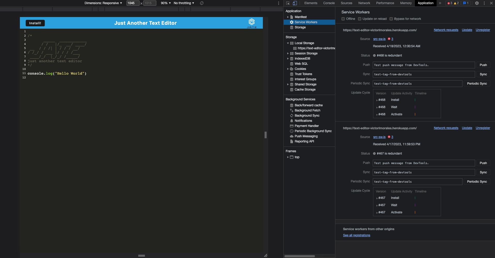
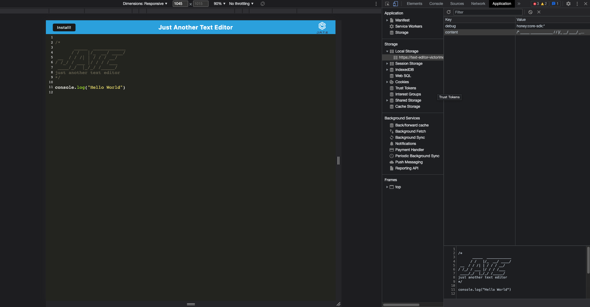
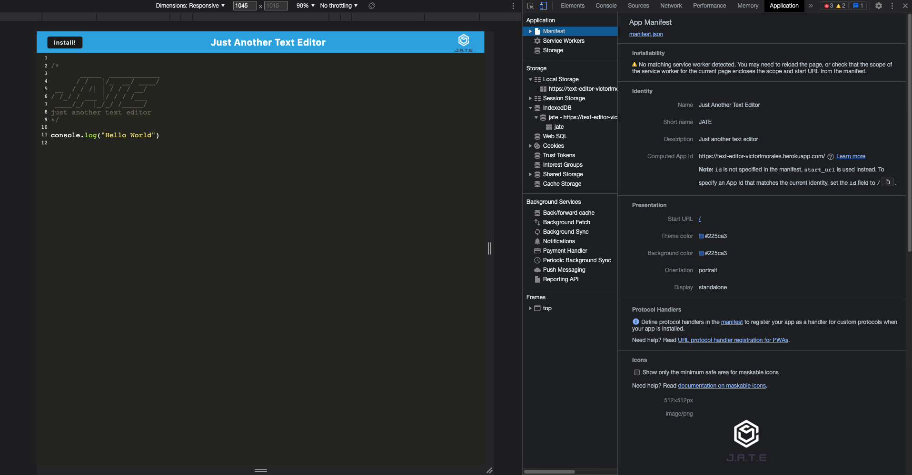
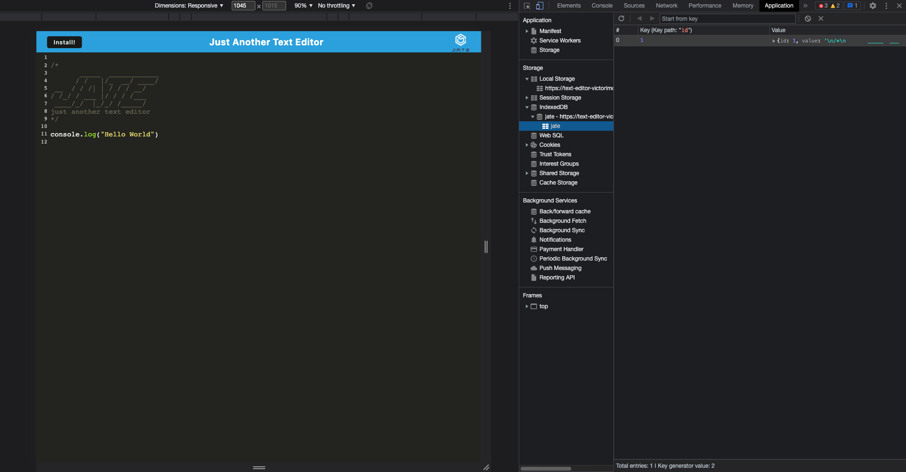

# Text-Editor  

## Table of Contents

* [Description](#description)
* [Usage](#usage)
* [Features](#features)
* [Screenshots](#screenshots)
* [Contributing](#contributing)
* [Tests](#tests)
* [Questions](#questions)
* [License](#license)
* [Credits](#credits)

## Description

  This application can be used to create notes in order to keep track on anything that might be neccessary.

## Usage

    1. To use this application all you need to do is click the link below under the Links section

    2. This link will take you directly to the application.

    3. Once you are in the application site you can type in any code you'd like.

    4. Whatever you typed will be saved in the `IndexedDB` database

## Features

N/A

## Screenshots

1. Below is a screenshot of the service worker

2. Below is a screenshot of the Local Storage key value pair

3. Below is a screenshot of the `manifest.json` file

4. Below is a screenshot of the IndexDB storage

## Contributing

  N/A

## Tests

  N/A

## Questions

  Have questions about this project?  
  GitHub: <https://github.com/victorlmorales>  
  Email: victor.l.morales2020@gmail.com

## Links

  [Deployed Apllication](<https://text-editor-victorlmorales.herokuapp.com/>)

## License

    This project is licensed under the MIT license.

## Credits

  Victor Morales